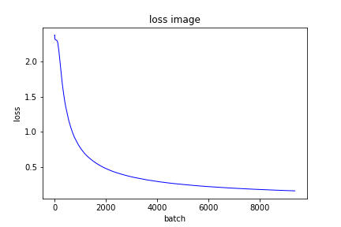

## LeNet 数字识别

###  训练

```
 python main.py -img D:/datasets/MNIST/raw/train-images-idx3-ubyte \
                -label D:/datasets/MNIST/raw/train-labels-idx1-ubyte \
                -t_img D:/datasets/MNIST/raw/t10k-images-idx3-ubyte \
                -t_label D:/datasets/MNIST/raw/t10k-labels-idx1-ubyte 
```

loss 图像



            accuracy :99.020000%


